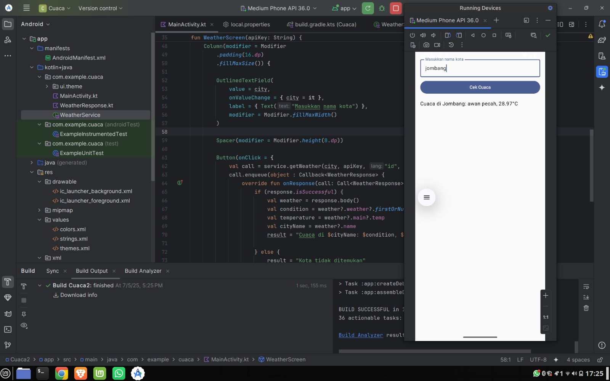

# WEATHER APPS

## Tampilan Aplikasi

# Aplikasi Cuaca Android 🌤️

Aplikasi ini memberikan informasi cuaca terkini dengan tampilan yang sederhana dan mudah digunakan.

## 🔑 Fitur Utama

### 📍 Tampilan Cuaca Terkini
Saat aplikasi dibuka, pengguna langsung disuguhi informasi cuaca terkini seperti:
- Suhu
- Kelembaban
- Kondisi cuaca (cerah, hujan, mendung, dll)

### 🔎 Pencarian Lokasi
Pengguna dapat mencari informasi cuaca berdasarkan nama kota atau lokasi tertentu dengan mudah.

### 🎨 Desain User Interface
Antarmuka aplikasi dibuat dengan desain **sederhana dan ringan**, sehingga nyaman digunakan oleh semua kalangan.

### 🔄 Update Real-Time
Aplikasi terhubung dengan API cuaca seperti **OpenWeatherMap** (atau sumber lain seperti **BMKG**), untuk memastikan informasi yang ditampilkan selalu **terbaru dan akurat**.

## 🚀 Teknologi yang Digunakan
- Kotlin / Java
- Retrofit (untuk koneksi API)
- Material Design (untuk UI)
- OpenWeatherMap API

---

